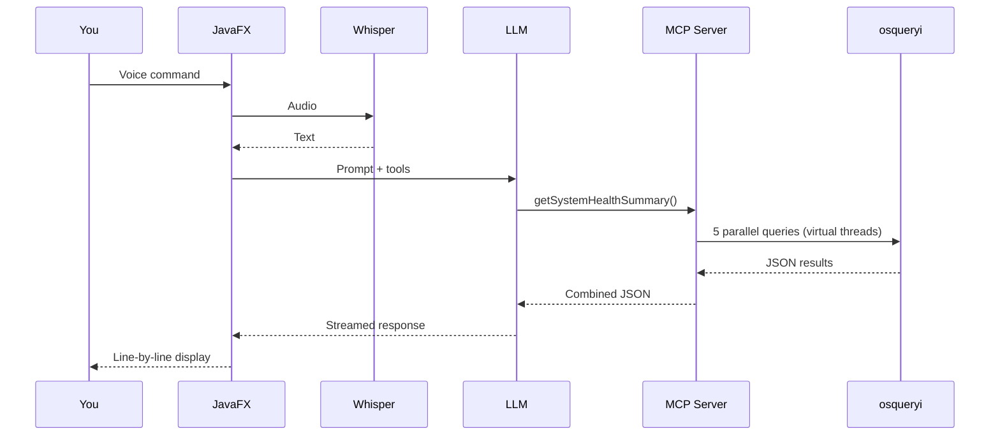
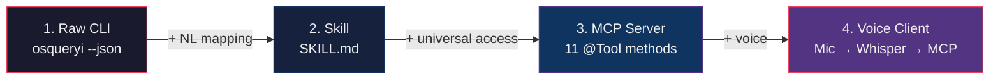
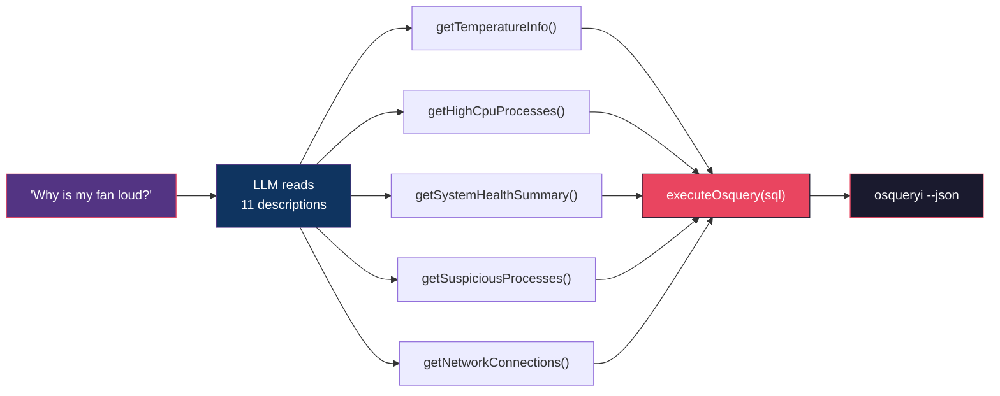

# Computer, Run a Level 1 Diagnostic

<div style="color: #e94560; font-size: 1.3em; margin-top: 0.5em;">
Building a Star Trek Computer with Java, Spring AI, and MCP
</div>

<div style="color: #64748b; font-size: 0.95em; margin-top: 2.5em;">
Ken Kousen | Virtual AI Day 2026
</div>

<!--
Open with the demo. Don't explain anything. Just switch to the Starfleet Voice Interface app, press the button, and say "Computer, run a level 1 diagnostic." Let the audience watch the tool calls stream in.

After the demo: "That was a JavaFX app, talking to a Spring Boot MCP server, which used osquery to inspect every aspect of my operating system — CPU, memory, disk, network, temperature — all from a voice command. Let me show you how simple this actually is."
-->

---
layout: center
background: 'linear-gradient(to bottom right, #0f3460, #1a1a2e)'
---

# DEMO

<div style="color: #e94560; font-size: 1.5em; margin-top: 1em;">
"Computer, run a level 1 diagnostic."
</div>

<!--
Switch to Starfleet Voice Interface. Press button, speak command, let it run.

Point out as it runs:
- The transcription appeared instantly (Whisper)
- Tool calls are streaming in (MCP server at work)
- Results stream line by line (Flux/reactive)
- The delay is the LLM synthesizing the response, not the server
-->

---
background: 'linear-gradient(to bottom right, #0f3460, #1a1a2e)'
---

## <span style="color: #e94560;">What Just Happened?</span>



<!--
Walk through this backwards from the result.

"Every piece of this is simple. The interesting part is how they compose together."

Key points:
- Voice to text: Whisper AI, fast
- Text to tool call: LLM reads the tool descriptions, picks the right one
- Tool execution: 5 osquery calls in parallel (virtual threads)
- Response: streamed back through the LLM, displayed line by line
-->

---
background: 'linear-gradient(to bottom right, #0f3460, #1a1a2e)'
---

## <span style="color: #e94560;">osquery: Your OS as SQL Tables</span>

<div style="display: grid; grid-template-columns: 1fr 1fr; gap: 1.5rem; margin: 1em 0;">

<div style="background: rgba(233, 69, 96, 0.1); padding: 1em; border-radius: 10px; border: 2px solid #e94560;">
<strong style="color: #e94560;">What's eating CPU?</strong>
<div style="margin-top: 0.5em; font-family: monospace; font-size: 0.75em; color: #94a3b8;">
SELECT name, pid,<br/>
&nbsp;&nbsp;(user_time + system_time) AS cpu_time<br/>
FROM processes<br/>
ORDER BY cpu_time DESC LIMIT 10
</div>
</div>

<div style="background: rgba(233, 69, 96, 0.1); padding: 1em; border-radius: 10px; border: 2px solid #e94560;">
<strong style="color: #e94560;">Why is my fan loud?</strong>
<div style="margin-top: 0.5em; font-family: monospace; font-size: 0.75em; color: #94a3b8;">
SELECT fan, name, actual, min, max<br/>
FROM fan_speed_sensors
</div>
</div>

</div>

<v-clicks>

<div style="background: rgba(52, 211, 153, 0.1); padding: 0.8em; border-radius: 8px; margin: 0.6em 0;">
Open-source from Meta. Cross-platform. Hundreds of tables. <strong style="color: #34d399;">Read-only</strong> — safe to hand to an AI.
</div>

<div style="background: rgba(251, 191, 36, 0.1); padding: 0.8em; border-radius: 8px; margin: 0.6em 0;">
<strong style="color: #fbbf24;">The catch:</strong> You need to know the tables, the columns, and the SQLite dialect.
</div>

<div style="background: rgba(96, 165, 250, 0.1); padding: 0.8em; border-radius: 8px; margin: 0.6em 0;">
<strong style="color: #60a5fa;">The idea:</strong> Let an LLM translate English into SQL, run it, and translate the results back.
</div>

</v-clicks>

<!--
Quick explanation of osquery for anyone who hasn't seen it.

"It's a utility from Meta that exposes your entire OS as SQL tables. Processes, network connections, fan speeds, temperature sensors — all queryable with SELECT statements."

"Read-only, so safe to hand to AI. But you need to know the tables and the SQL. What I'm going to do is let a large language model handle that translation."
-->

---
background: 'linear-gradient(to bottom right, #0f3460, #1a1a2e)'
---

## <span style="color: #e94560;">The Progression: CLI to Voice</span>



<v-clicks>

<div style="display: grid; grid-template-columns: 1fr 1fr 1fr 1fr; gap: 0.8rem; margin: 0.8em 0; font-size: 0.85em;">

<div style="background: rgba(233, 69, 96, 0.1); padding: 0.6em; border-radius: 8px; text-align: center;">
<strong style="color: #e94560;">Raw osquery</strong><br/>
<span style="color: #94a3b8;">Must know SQL</span>
</div>

<div style="background: rgba(15, 52, 96, 0.5); padding: 0.6em; border-radius: 8px; text-align: center;">
<strong style="color: #60a5fa;">Skill</strong><br/>
<span style="color: #94a3b8;">Claude Code only</span>
</div>

<div style="background: rgba(83, 52, 131, 0.3); padding: 0.6em; border-radius: 8px; text-align: center;">
<strong style="color: #a78bfa;">MCP Server</strong><br/>
<span style="color: #94a3b8;">Any MCP client</span>
</div>

<div style="background: rgba(233, 69, 96, 0.2); padding: 0.6em; border-radius: 8px; text-align: center;">
<strong style="color: #e94560;">Voice Client</strong><br/>
<span style="color: #94a3b8;">Anyone can use it</span>
</div>

</div>

</v-clicks>

<!--
This is the teaching arc. Each layer adds reach without changing the core.

Layer 1: osquery. Powerful but requires SQL.

Layer 2: Skill. Just a markdown file that teaches Claude Code how to use osquery. Show .claude/skills/osquery/SKILL.md briefly. "Skills are great — but proprietary to tools that understand them."

Layer 3: MCP Server. "By wrapping the same capability as an MCP server, any MCP client can discover and use it — Claude Desktop, VS Code, Cursor, IntelliJ, or your own app."

Layer 4: Voice Client. JavaFX + Whisper AI. "Now anyone can use it without typing."
-->

---
background: 'linear-gradient(to bottom right, #0f3460, #1a1a2e)'
---

## <span style="color: #e94560;">What is MCP?</span>

<v-clicks>

<div style="background: rgba(233, 69, 96, 0.1); padding: 1em; border-radius: 10px; border: 2px solid #e94560; margin: 0.8em 0;">
<strong style="color: #e94560; font-size: 1.2em;">Model Context Protocol</strong><br/>
<span style="color: #94a3b8;">A standard way for AI tools to discover and call your capabilities</span>
</div>

<div style="display: grid; grid-template-columns: 1fr 1fr; gap: 1.5rem; margin: 1em 0;">

<div style="background: rgba(96, 165, 250, 0.1); padding: 0.8em; border-radius: 8px;">
<strong style="color: #60a5fa;">Server exposes:</strong><br/>
<span style="color: #93c5fd;">Tools (functions the AI can call)<br/>Resources (data the AI can read)<br/>Prompts (templates for interaction)</span>
</div>

<div style="background: rgba(52, 211, 153, 0.1); padding: 0.8em; border-radius: 8px;">
<strong style="color: #34d399;">Client gets:</strong><br/>
<span style="color: #86efac;">Auto-discovery of available tools<br/>JSON-RPC over STDIO<br/>Works with any MCP-compatible AI</span>
</div>

</div>

<div style="background: linear-gradient(135deg, #e94560, #533483); padding: 1em; border-radius: 10px; text-align: center; margin: 0.8em 0;">
<span style="color: #fef3c7; font-size: 1.1em;">Think of MCP as what <strong>REST was for web services</strong>.<br/>A standard protocol so tools don't need to know about each other's implementation.</span>
</div>

</v-clicks>

<!--
Brief conceptual explanation. Don't go deep on the protocol — just establish the mental model.

"MCP is a protocol that lets AI tools discover and call your capabilities. The server advertises what it can do. The client discovers those tools automatically. They communicate over JSON-RPC, typically over STDIO."

"Think of it as what REST was for web services. A standard so tools can interoperate without knowing each other's internals."
-->

---
background: 'linear-gradient(to bottom right, #0f3460, #1a1a2e)'
---

## <span style="color: #e94560;">Spring AI: @Tool Is All You Need</span>

<div style="font-size: 0.85em;">

```java {all|1-4|5|6}
@Tool(description = """
     Execute osquery SQL queries to inspect system state.
     Query processes, users, network connections, and other OS data.
     Example: SELECT name, pid FROM processes""")
public String executeOsquery(String sql) {
    ProcessBuilder pb = new ProcessBuilder("osqueryi", "--json", sql);
    // ... read output, handle timeout, return JSON
}
```

</div>

<v-clicks>

<div style="background: rgba(52, 211, 153, 0.1); padding: 0.8em; border-radius: 8px; margin: 0.6em 0;">
<strong style="color: #34d399;">One annotation.</strong> Spring AI scans for @Tool methods, registers them with MCP, handles JSON-RPC, tool discovery, serialization — everything.
</div>

<div style="background: rgba(251, 191, 36, 0.1); padding: 0.8em; border-radius: 8px; margin: 0.6em 0;">
<strong style="color: #fbbf24;">The description is doing real work.</strong> It's not documentation for humans — it's the contract with the LLM. Write it like you're explaining to a capable intern what this method is for.
</div>

</v-clicks>

<!--
OsqueryService.java:48-57

"This is the entire MCP integration. One annotation. The description tells the LLM what the tool does. The method takes SQL, shells out to osqueryi via ProcessBuilder, returns JSON. That's the whole server, conceptually."

"Spring AI's MCP server starter does the rest — scanning, registering, protocol handling."

Switch to the actual code in the IDE to show this in context.
-->

---
background: 'linear-gradient(to bottom right, #0f3460, #1a1a2e)'
---

## <span style="color: #e94560;">Why 11 Tools Instead of 1?</span>



<v-click>

<div style="background: rgba(96, 165, 250, 0.1); padding: 0.8em; border-radius: 8px;">
<strong style="color: #60a5fa;">Think of it as indexing.</strong> Each tool is a well-labeled entry point. The more specific your tools, the more reliably the LLM picks the right one. The generic <code>executeOsquery</code> is still there as a fallback.
</div>

</v-click>

<!--
OsqueryService.java — scroll through method list:
- getHighCpuProcesses() — line 159
- getHighMemoryProcesses() — line 171
- getNetworkConnections() — line 184
- getTemperatureInfo() — line 198
- getSystemHealthSummary() — line 234
- getSuspiciousProcesses() — line 277
- getHighDiskIOProcesses() — line 301

"I could expose just executeOsquery(sql) and let the LLM figure out the SQL. But that puts all the burden on the model."

"Instead, each tool has a descriptive name and description. When you say 'why is my fan running hot?', the LLM matches to getTemperatureInfo() based on the description: 'System temperature and fan speeds. Useful for: Why is my fan running?'"

"Think of it as indexing. More specific tools = more reliable matching."
-->

---
background: 'linear-gradient(to bottom right, #0f3460, #1a1a2e)'
---

## <span style="color: #e94560;">Virtual Threads: 5 Queries in Parallel</span>

<div style="font-size: 0.8em;">

```java {all|1|2-9|11-17}
try (var executor = Executors.newVirtualThreadPerTaskExecutor()) {
    var cpuFuture = CompletableFuture.supplyAsync(
            this::getHighCpuProcesses, executor);
    var memoryFuture = CompletableFuture.supplyAsync(
            this::getHighMemoryProcesses, executor);
    var diskFuture = CompletableFuture.supplyAsync(
            () -> executeOsquery("SELECT ... FROM mounts ..."), executor);
    var networkFuture = CompletableFuture.supplyAsync(
            this::getNetworkConnections, executor);

    return """
        System Health Summary:
        CPU: %s
        Memory: %s
        Disk: %s
        Network: %s
        """.formatted(
            cpuFuture.join(), memoryFuture.join(),
            diskFuture.join(), networkFuture.join());
}
```

</div>

<v-click>

<div style="background: rgba(52, 211, 153, 0.1); padding: 0.8em; border-radius: 8px;">
<strong style="color: #34d399;">No thread pool tuning. No reactive complexity.</strong> Straightforward concurrent code that reads like sequential code. That's the virtual threads promise.
</div>

</v-click>

<!--
OsqueryService.java:234-269 — getSystemHealthSummary()

"When you ask for a system diagnostic, I need CPU, memory, disk, network, and temperature. Five independent osquery calls. Sequential = 5x as long."

Line 235: "One line gives me a lightweight executor."

Lines 236-244: "Five CompletableFuture.supplyAsync calls. Each shells out to osqueryi independently on its own virtual thread."

Lines 246-268: "Join them all with a text block. The .join() calls block, but on virtual threads that blocking is essentially free."
-->

---
background: 'linear-gradient(to bottom right, #0f3460, #1a1a2e)'
---

## <span style="color: #e94560;">The Client: Spring AI + JavaFX</span>

<div style="font-size: 0.75em;">

```java {all|1-2|4-10|11-12}
public McpClientService(OpenAiChatModel chatModel,
                        SyncMcpToolCallbackProvider toolCallbackProvider) {

chatClient.prompt()
    .system("""
        You are the main computer aboard a Starfleet vessel,
        but your actual capabilities are limited to
        macOS system diagnostics via osquery.
        If outside your capabilities, respond in character...""")
    .user(command)
    .toolCallbacks(callbacks).stream().content()
    .doOnNext(onChunk).subscribe();
```

</div>

<v-clicks>

<div style="background: rgba(96, 165, 250, 0.1); padding: 0.6em; border-radius: 8px; margin: 0.4em 0;">
<strong style="color: #60a5fa;">Auto-discovery:</strong> <code>SyncMcpToolCallbackProvider</code> finds all 11 tools from the server automatically via MCP.
</div>

<div style="background: rgba(251, 191, 36, 0.1); padding: 0.6em; border-radius: 8px; margin: 0.4em 0;">
<strong style="color: #fbbf24;">Server: Java 25</strong> (virtual threads, text blocks) · <strong style="color: #fbbf24;">Client: Java 21</strong> (JavaFX) · <strong>MCP doesn't care — it's just a protocol.</strong>
</div>

</v-clicks>

<!--
McpClientService.java:22-25 — constructor injection
McpClientService.java:34-61 — processCommand method

"The client gets two things injected: a chat model and a tool callback provider. Spring AI auto-discovers all 11 tools through MCP's discovery protocol."

"The system prompt sets the Star Trek character. .stream().content() gives us a Flux — reactive streaming. Each chunk flows to the JavaFX UI as generated."

"Notice — when I said 'arm phasers', it stayed in character. That's just prompt engineering, but it makes the demo fun."

Also briefly show VoiceController.java:86-115 — press, record, release, transcribe, send, stream back.
-->

---
background: 'linear-gradient(to bottom right, #0f3460, #1a1a2e)'
---

## <span style="color: #e94560;">The Pattern Generalizes</span>

<v-clicks>

<div style="display: grid; grid-template-columns: 1fr 1fr; gap: 1.5rem; margin: 1em 0;">

<div style="background: rgba(233, 69, 96, 0.1); padding: 1em; border-radius: 10px; border: 2px solid #e94560;">
<strong style="color: #e94560; font-size: 1.1em;">What I built</strong><br/><br/>
<span style="color: #94a3b8;">
@Tool methods wrapping <code>osqueryi</code><br/>
via ProcessBuilder<br/><br/>
Natural language → SQL → system data
</span>
</div>

<div style="background: rgba(52, 211, 153, 0.1); padding: 1em; border-radius: 10px; border: 2px solid #34d399;">
<strong style="color: #34d399; font-size: 1.1em;">What you could build</strong><br/><br/>
<span style="color: #86efac;">
@Tool methods wrapping <em>any CLI tool</em><br/>
@Tool methods wrapping <em>any REST API</em><br/>
@Tool methods wrapping <em>any database</em>
</span>
</div>

</div>

<div style="background: rgba(96, 165, 250, 0.1); padding: 0.8em; border-radius: 8px; margin: 0.6em 0;">
<strong style="color: #60a5fa;">Tool design tip:</strong> Spend more time on descriptions than code. <em>"System temperature and fan speeds. Useful for: Why is my fan running?"</em> — that's what makes the LLM pick the right tool.
</div>

<div style="background: linear-gradient(135deg, #e94560, #533483); padding: 1em; border-radius: 10px; text-align: center; margin: 0.8em 0;">
<span style="color: #fef3c7; font-size: 1.1em;">A Skill works in <strong>one tool</strong>. An MCP server works <strong>everywhere</strong>.</span>
</div>

</v-clicks>

<!--
"Forget osquery for a moment. The pattern works for anything:"
- Internal CLI tool? Wrap it in @Tool methods.
- REST API that's hard to use? Same thing.
- Database with complex queries? Pre-build the common ones as tools.

"You're building a natural language interface to existing capabilities. MCP makes it universally accessible."

"I spent more time writing tool descriptions than writing code."
-->

---
background: 'linear-gradient(to bottom right, #0f3460, #1a1a2e)'
---

## <span style="color: #e94560;">The Stack</span>

<div style="font-size: 0.9em;">

| Component | Technology | Purpose |
|---|---|---|
| Voice capture | JavaFX + Java Sound API | Record audio from microphone |
| Transcription | Whisper AI (OpenAI) | Speech to text |
| MCP Client | Spring AI 2 / Java 21 | Send commands, stream results |
| MCP Server | Spring Boot 4 / Java 25 | 11 @Tool methods over STDIO |
| Parallel execution | Virtual threads | 5 concurrent osquery calls |
| System queries | osquery (Meta) | OS data as SQL tables |
| LLM | GPT-5 Nano | Tool selection + response synthesis |

</div>

<v-click>

<div style="background: rgba(251, 191, 36, 0.1); padding: 0.8em; border-radius: 8px; margin-top: 1em;">
<span style="color: #fbbf24;">The server is ~300 lines. The client is ~300 lines. If you've got 30 minutes after this talk, you could have your own MCP server wrapping your favorite CLI tool.</span>
</div>

</v-click>

<!--
Quick reference slide. Don't dwell on this — it's here for people who want to take a photo.

"The server is about 300 lines. The client is about the same. This is not a complex application. The value is in the pattern and the composition."
-->

---
background: 'linear-gradient(135deg, #0f3460 0%, #1a1a2e 100%)'
---

## <span style="color: #e94560;">Thank You</span>

<div style="display: grid; grid-template-columns: 1fr 1fr; gap: 2rem; margin-top: 1em;">

<div>

<div style="background: rgba(233, 69, 96, 0.15); padding: 1em; border-radius: 10px; margin: 0.5em 0;">
<strong style="color: #e94560;">GitHub Repos</strong><br/>
<span style="color: #94a3b8; font-size: 0.85em;">
MCP Server: <code>github.com/kousen/OsqueryMcpServer</code><br/>
Voice Client: <code>github.com/kousen/starfleet-voice-interface</code>
</span>
</div>

<div style="background: rgba(52, 211, 153, 0.15); padding: 1em; border-radius: 10px; margin: 0.5em 0;">
<strong style="color: #34d399;">Inspiration</strong><br/>
<span style="color: #86efac; font-size: 0.85em;">
Daniela Petruzalek's blog post:<br/>
"Turning my computer into the USS Enterprise using AI agents"
</span>
</div>

</div>

<div>

<div style="color: #94a3b8; margin-top: 0.5em; line-height: 2;">

<strong style="color: #e94560;">Ken Kousen</strong><br/>
<a href="https://kousenit.com" style="color: #60a5fa;">kousenit.com</a><br/>
<a href="https://kenkousen.substack.com" style="color: #60a5fa;">kenkousen.substack.com</a><br/>
<a href="https://youtube.com/@talesfromthejarside" style="color: #60a5fa;">Tales from the Jar Side</a>

</div>

</div>

</div>

<!--
"I started this project because I saw Daniela's great blog post about building a USS Enterprise computer in Python. I wanted to do it in Java, and each layer snapped together more easily than I expected."

"The code is all on GitHub. If you've got 30 minutes, you could have your own MCP server wrapping your favorite command-line tool."

"Thank you."
-->
